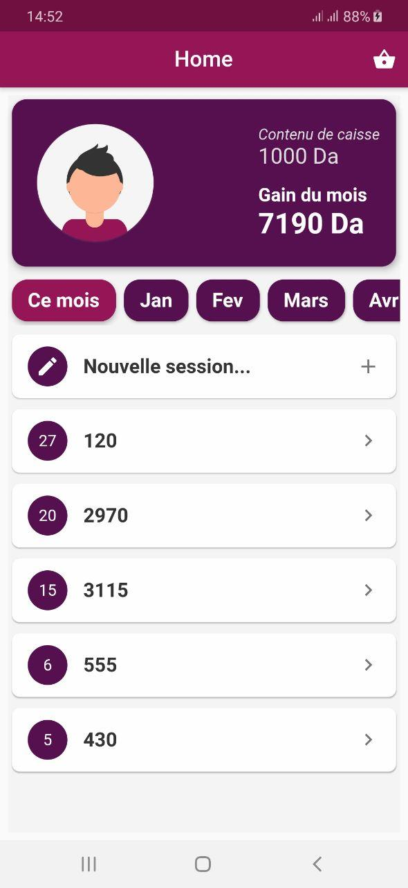
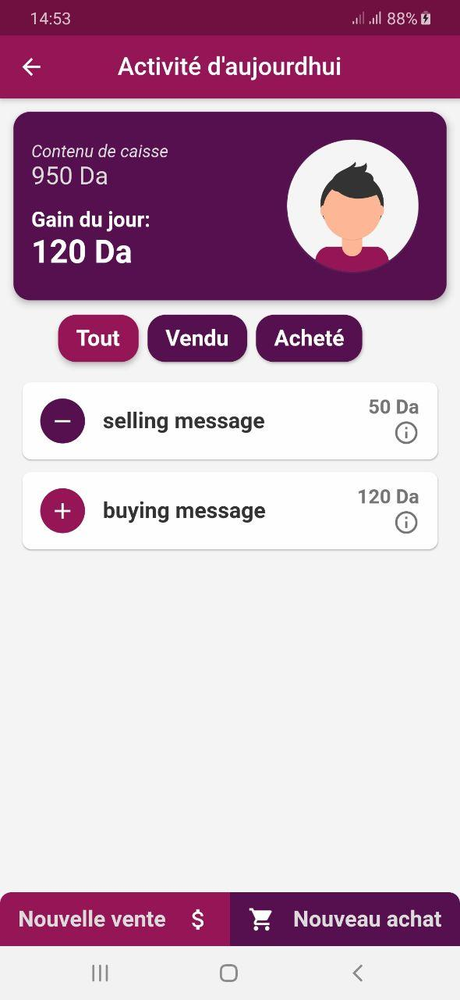
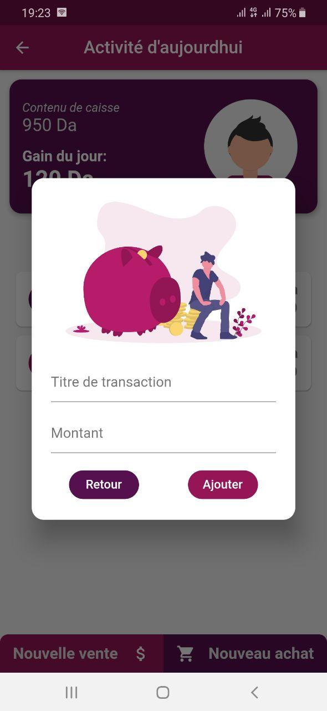
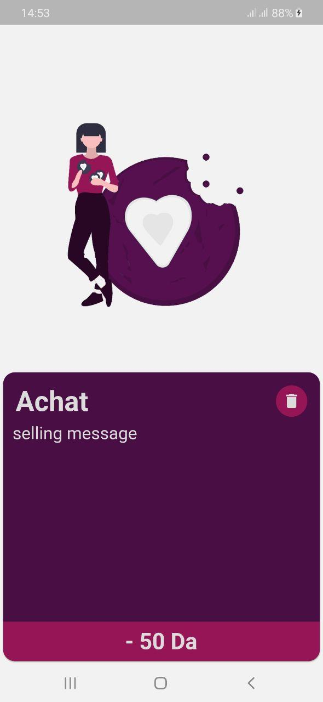
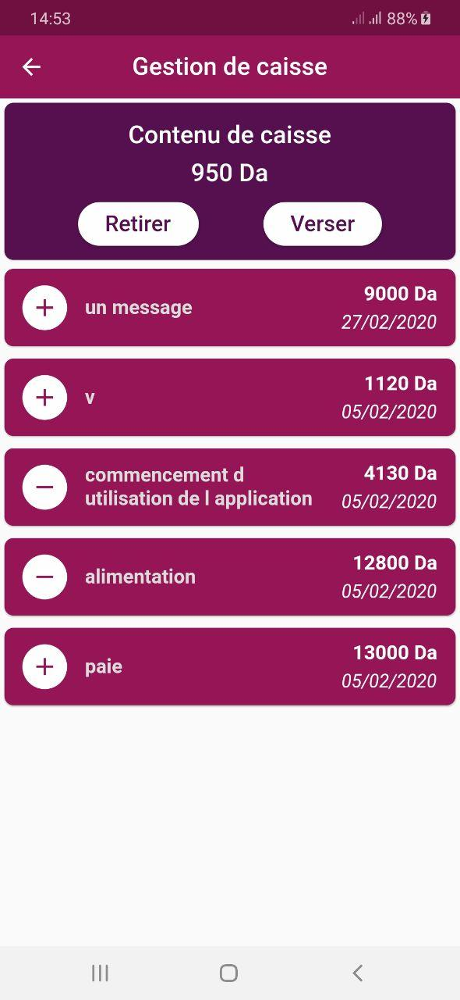
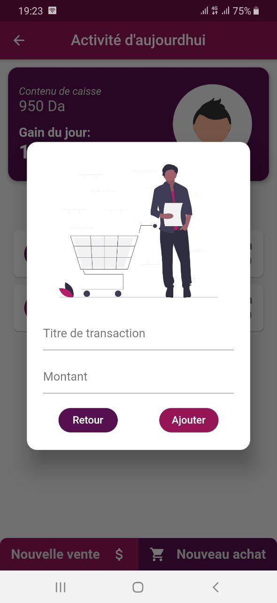

# Shop Manager Flutter

A small app to manager simple transactions made in a shop (selling, buying, register handling..etc).

## Screenshot:
                             
  

## Features:
* Details are included in days elements which are included in months tabs for a good UX.
* The app keeps track of register content and monthly gain in a seperate way.
* inside each day, selling and buying actions are seperated for better detailings.
* Each transaction is detailed in it's own screen for better UX.
* The register handling is seperated from the rest of the app's workflow for a better UI presentation.
* Everything is saved in a local Sqlite database.

## TODO:
* [ ] Hook the app with an API for remote saving.
* [ ] Adding accounts for different users.
* [ ] Adding E-Payement and delivery options.
* [ ] Adding rating, charts and detailed statistics.

## Tools used:
* Android studio (IDE)
* Dart (logic)
* Flutter (Mobile UI developement kit).
* Paint.Net (Image editting)

Flutter is Google's SDK for crafting beautiful, fast user experiences for
mobile, web and desktop from a single codebase. Flutter works with existing
code, is used by developers and organizations around the world, and is free
and open source.

## Documentation

* [Install Flutter](https://flutter.dev/get-started/)
* [Flutter documentation](https://flutter.dev/docs)

For announcements about new releases and breaking changes, follow the
[flutter-announce@googlegroups.com](https://groups.google.com/forum/#!forum/flutter-announce)
mailing list.

## Contribution:
Feel free to `fork` this project and add whatever you like. If you have any suggestions or any comments please feel free to contact me or to open an issue, use free license art assets please.

## Team:
[Jetlighters](https://github.com/JetLightStudio) having fun.
